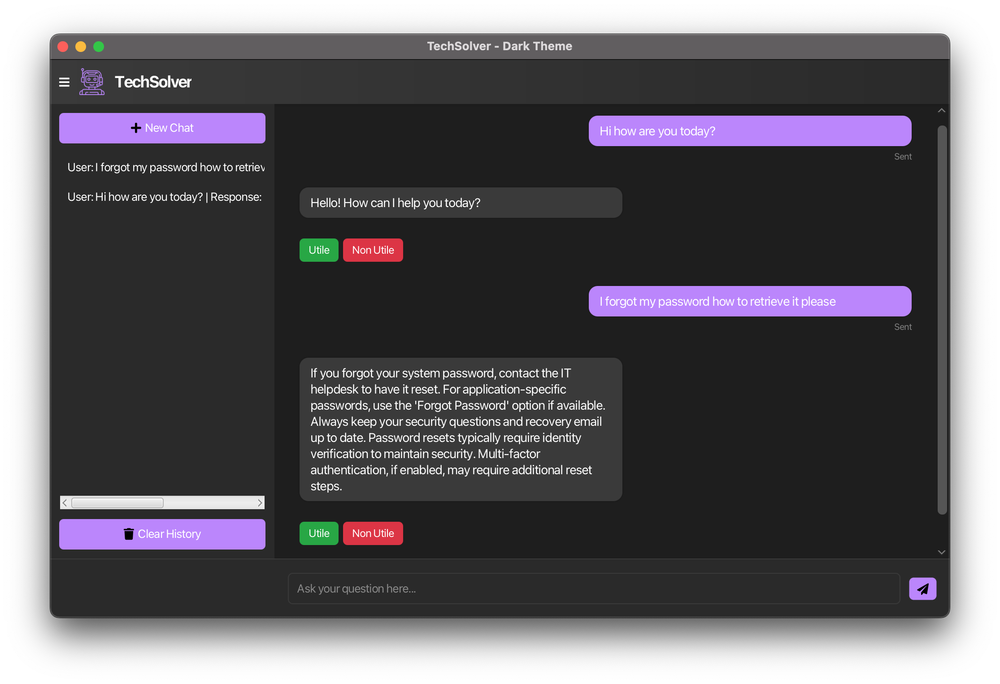

# 💬 IT Helpdesk Chatbot

   



This is a simple IT Helpdesk chatbot built in **Java** combining intent matching with **Apache's OpenNLP** library for natural language processing and fallback to a language model when necessary, we're using here **Ollama**. All this is wrapped in a user-friendly **JavaFX** interface.

---

## 🧠 Features

### 🔍 Local Intent Matching  
The chatbot processes your question using basic *NLP* and tries to find the best match from a list of predefined Q&A pairs.

### 🤖 LLM Fallback  
If it doesn’t find a close enough match, it sends the question to a language model (e.g., Ollama or OpenAI) and returns the response.

### 🗃️ JSON-Based Knowledge Base  
All the questions and answers live in a single `knowledge_base.json` file, which you can update or extend easily.

### 🖥️ Simple JavaFX Interface  
You can use the chatbot through a graphical window thanks to JavaFX.

---

## 🛠️Setup

### Requirements

- Java 21 or newer
- Maven
- Ollama (or any LLM API you prefer)

### Installation

1. **Clone the repository**
   ```bash
   git clone https://github.com/noalibi99/ITHelpdeskChatbot.git
   cd ITHelpdeskChatbot
   ```

2. **Install dependencies**
   ```bash
   mvn clean install
   ```

3. **Configure Ollama (Optional)**
   ```bash
   # Pull a lightweight model for testing
   ollama pull llama3.2:1b
   
   # Or use a more capable model
   ollama pull llama3.2:3b
   ```

4. **Run the application**
   ```bash
   mvn javafx:run
   ```

### Configuration

- **Knowledge Base**: Edit `src/main/resources/knowledge_base.json` to customize Q&A pairs
- **LLM Settings**: Modify `src/main/java/config/OllllamaClientava` to change model endpoints or API keys
- **NLP Models**: Apache OpenNLP models are automatically downloaded on first run

### Troubleshooting

- **JavaFX Issues**: Ensure your JDK includes JavaFX or add it as a dependency
- **Ollama Connection**: Verify Ollama is running with `ollama list`
- **Maven Build Errors**: Check Java version compatibility with `mvn -version`
